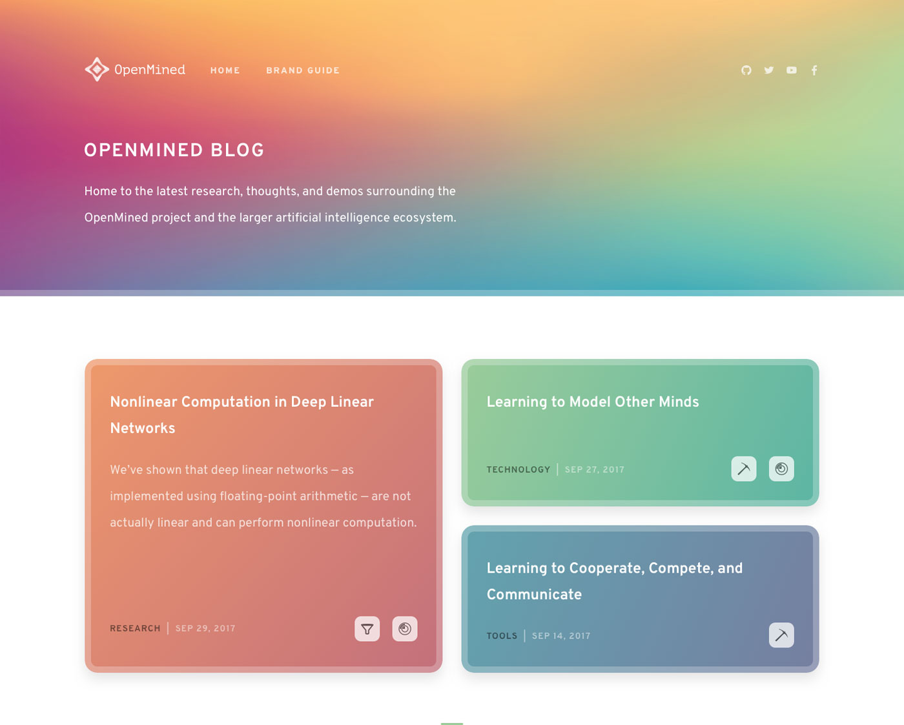

# OpenMined

The default theme for all OpenMined [Ghost](http://github.com/tryghost/ghost/) blogs. This is based heavily on the default Ghost theme [Casper](https://github.com/TryGhost/Casper).

&nbsp;




# Development

Styles are compiled using Gulp/PostCSS to polyfill future CSS spec. You'll need Node and Gulp installed globally. After that, from the theme's root directory:

```bash
$ yarn install
$ yarn dev
```

Now you can edit `/assets/css/` files, which will be compiled to `/assets/built/` automatically.

The `zip` Gulp task packages the theme files into `dist/<theme-name>.zip`, which you can then upload to your site.

```bash
$ yarn zip
```

# PostCSS Features Used

- Autoprefixer - Don't worry about writing browser prefixes of any kind, it's all done automatically with support for the latest 2 major versions of every browser.
- Variables - Simple pure CSS variables
- [Color Function](https://github.com/postcss/postcss-color-function)


# SVG Icons

This theme uses inline SVG icons, included via Handlebars partials. You can find all icons inside `/partials/icons`. To use an icon just include the name of the relevant file, eg. To include the SVG icon in `/partials/icons/rss.hbs` - use `{{> "icons/rss"}}`.

You can add your own SVG icons in the same manner.
